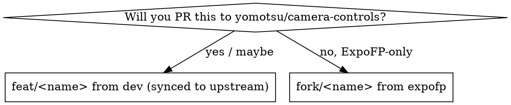

# fork-feature

## Overview

New work in this fork must branch from the **right base**, or the upstream PR drags in
unrelated commits. Two kinds of change, two bases:

- **Upstream-bound** (`feat/<name>`) → sync the pristine mirror, then branch from **`dev`**.
- **Fork-only** (`fork/<name>`) → branch from **`expofp`** (our trunk).

`dev` is our pristine mirror of `upstream/dev`. Always fast-forward it to upstream (local
and `origin`) **before** cutting a `feat/*` branch, so the mirror never drifts and every
feature starts from a base upstream actually has.

**Never branch a `feat/*` off `expofp`** — `expofp` carries all our other patches, so the
PR diff would include them. This is the single mistake this skill exists to prevent.

## When to use

- Starting any new feature or fix in `expofp`'s repo.
- Deciding where a change should live before writing code.

## Decision



If unsure, treat it as upstream-bound (`feat/`) — anything based on pristine upstream can
still be merged into `expofp` for immediate use, and later PR'd or kept.

## Commands

Upstream-bound — sync the mirror (local + origin), then branch from it:
```bash
git fetch upstream --tags
git checkout dev
git merge --ff-only upstream/dev      # fails loudly if dev was ever committed to
git push origin dev                   # keep origin mirror in lockstep
git checkout -b feat/<name>           # base = freshly-synced dev
```

Fork-only:
```bash
git fetch origin
git checkout -b fork/<name> origin/expofp
```

## Using the change immediately

You don't have to wait for an upstream merge. After pushing the `feat/*` branch (and
opening the PR with `gh --repo yomotsu/camera-controls`), merge it into `expofp` to ship it:

```bash
git checkout expofp && git merge --no-ff feat/<name> && git push origin expofp
```

The push to `expofp` triggers a release. When upstream later merges the same change, the
next `fork-sync` de-duplicates it automatically.

## Common mistakes

| Mistake | Fix |
|---|---|
| `feat/*` branched off `expofp` | Re-create from synced `dev`; the PR must diff only your change. |
| Branching before syncing `dev` | Always `merge --ff-only upstream/dev` + `push origin dev` first, or the base is stale. |
| `merge --ff-only` on `dev` fails | `dev` was committed to directly — it's no longer pristine. Stop and fix; don't force. |
| Naming a fork-only change `feat/*` | Use `fork/*` so `fork-sync`/`fork-status` can tell them apart. |
